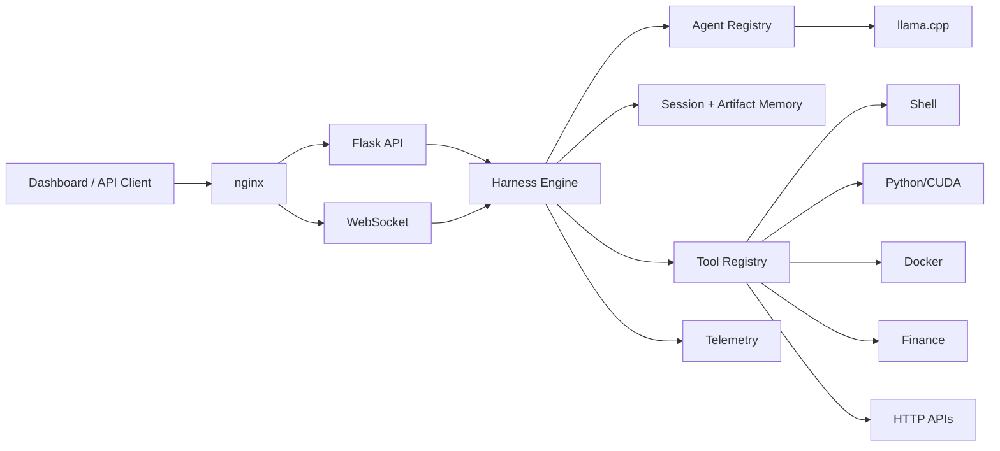

# QuantLab AI Capital Harness

Self-hosted multi-agent runtime inspired by Codex CLI, Claude Code, and Devin-style harnesses, designed for QuantLab AI Capital on Ubuntu + Docker + NVIDIA Tesla T4.

## What ships here
- Multi-agent orchestration (`planner`, `coding`, `finance`, `research`, `validation`, `execution`)
- LLM loop backed by `llama.cpp` OpenAI-compatible chat endpoint
- Tool registry for shell, Python, files, Docker, finance, and HTTP APIs
- Session memory, summaries, and artifact storage
- JWT-protected Flask API + WebSocket channel
- Structured logging and Prometheus metrics
- JSONL agent trajectories for post-run debugging and offline evaluation
- Hedge-fund style dark dashboard
- Docker Compose stack with nginx, PostgreSQL, Redis, llama.cpp, JupyterLab
- Validation scripts and reusable workflows

## Architecture


## Project structure
```text
core/ runtime/ orchestrator/ tools/ memory/ agents/ policies/ telemetry/
api/ frontend/ websocket/ workflows/ deploy/ scripts/ tests/
```

## Quick start
1. Copy `.env.example` to `.env` and replace all secrets.
2. Put model files in `./models/`.
3. Run `./scripts/bootstrap.sh`.
4. Open the dashboard through nginx.
5. Mint JWTs from your auth service and store one in browser local storage as `token`.

## API
- `POST /v1/chat`
- `GET /v1/agents`
- `GET /v1/tools`
- `GET /v1/tasks`
- `GET /v1/models`
- `GET /v1/memory`
- `GET /v1/system`
- `GET /v1/metrics`

## Example request
```bash
curl -X POST http://localhost/v1/chat \
  -H "Authorization: Bearer $JWT" \
  -H "Content-Type: application/json" \
  -d '{"session_id":"demo","agent":"planner","message":"Create a backtest plan for SPY and QQQ"}'
```

## GPU profiles
- CPU mode: `ENABLE_CUDA=false`
- CUDA mode: `ENABLE_CUDA=true`
- `llama.cpp` uses GPU layers through `-ngl 99`
- Python tools can opt into CUDA-aware execution; PyTorch/TensorFlow/cuDF/XGBoost packages should be pinned to the CUDA stack you deploy.

## Production deployment
- Put Cloudflare in front of nginx.
- Terminate TLS at Cloudflare or extend nginx with origin certificates.
- Restrict admin routes to Tailscale/private networks.
- Replace default Postgres credentials.
- Move secrets into Docker secrets or Vault.
- Add database migrations before persistent model/task tables.
- Run node exporters / NVIDIA DCGM exporter beside this stack for richer host metrics.

## Security posture
- JWT + RBAC on protected routes
- Shell command whitelist and forbidden-pattern checks
- nginx rate limiting
- prompt injection guard
- no root shell path in the harness
- bounded tool execution timeouts

## Monitoring
- Prometheus-compatible metrics at `/v1/metrics`
- JSON logs through `structlog`
- Agent runs are appended to `storage/artifacts/trajectories/YYYY-MM-DD.jsonl`
- Dashboard surfaces agents, tools, memory, tasks, and host pressure

## Validation
```bash
./scripts/validate.sh
```
The validation workflow runs tests and lint checks. Extend `runtime/validator.py` to add API smoke tests, log inspection, and automatic repair recipes.

## Real workflows
- Coding: plan → implement → test → review → artifact
- Finance: load data → analyze → backtest → validate → report
- Research: scope → collect → synthesize → cite → publish
- Debugging: reproduce → inspect → patch → test → summarize
- Deployment: preflight → backup → deploy → healthcheck → rollback plan

## Current extension seams
- Replace JSON-file memory with PostgreSQL-backed persistence.
- Add vector memory using pgvector.
- Expand agent collaboration into explicit delegation queues in Redis.
- Add notebook execution and artifact previews.
- Add model routing between Nous-Hermes and Qwen2.5.
- Add GEPA/DSPy-style offline prompt and skill evaluation using the saved trajectories.
